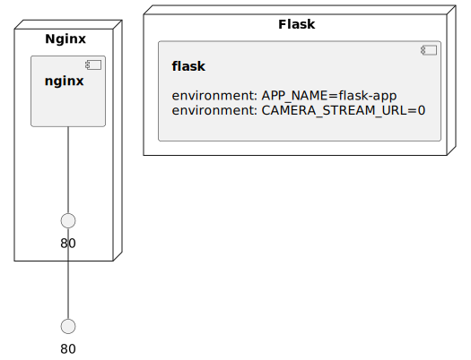

# dj-playground
- Various apps built by python `Django` framework.

## Ref
- Django learning
	- https://github.com/zaxlct/python-django-learning
- Microservice Python
	- [Distributed Tasks Demystified with Celery, SQS & Python](https://www.udemy.com/course/distributed-tasks-demystified-with-celery-python/?LSNPUBID=BoHFIyu6APU&ranEAID=BoHFIyu6APU&ranMID=39197&ranSiteID=BoHFIyu6APU-eubZnlLKSs0K_MDTwkmc.w&utm_medium=udemyads&utm_source=aff-campaign)

### Infrastructure model

- [flask component model](.infragenie/flask_component_model.svg)

---
